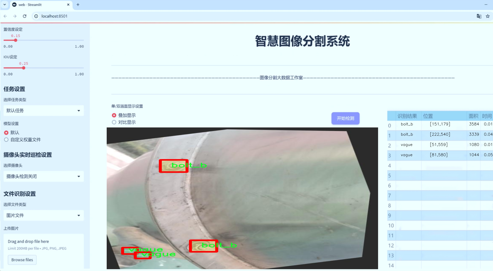

# 螺栓图像分割系统： yolov8-seg-C2f-DLKA

### 1.研究背景与意义

[参考博客](https://gitee.com/YOLOv8_YOLOv11_Segmentation_Studio/projects)

[博客来源](https://kdocs.cn/l/cszuIiCKVNis)

研究背景与意义

随着工业自动化和智能制造的快速发展，图像处理技术在各个领域的应用愈发广泛，尤其是在机械工程和制造业中，图像分割技术成为了实现高效自动化的重要手段之一。螺栓作为机械连接中不可或缺的基本元件，其准确识别与分割对于产品的质量控制、生产效率提升以及后续的自动化装配过程具有重要意义。然而，传统的图像处理方法在复杂背景下对螺栓的识别和分割效果往往不尽如人意，尤其是在多种类螺栓共存的情况下，如何有效区分不同类型的螺栓并进行精确分割，成为了一个亟待解决的技术难题。

近年来，深度学习技术的迅猛发展为图像分割任务提供了新的解决方案。其中，YOLO（You Only Look Once）系列模型因其高效的实时检测能力和较强的特征提取能力，逐渐成为目标检测和分割领域的研究热点。YOLOv8作为该系列的最新版本，结合了更为先进的网络结构和优化算法，能够在保证高精度的同时，实现更快的推理速度。然而，尽管YOLOv8在目标检测方面表现出色，但在细粒度的图像分割任务中，仍然存在一定的局限性，尤其是在处理多类别、复杂背景的图像时，模型的鲁棒性和准确性亟需提升。

本研究旨在基于改进的YOLOv8模型，构建一个高效的螺栓图像分割系统。我们将使用一个包含1300张图像的数据集，该数据集包含四个类别的螺栓（bolt_a、bolt_b、bolt_c）以及一个模糊类别（vague），为模型的训练和评估提供了丰富的样本。这一数据集的多样性和复杂性为模型的优化提供了良好的基础，能够有效地测试和验证改进算法的有效性。

通过对YOLOv8模型的改进，我们将引入多种技术手段，如特征金字塔网络（FPN）、注意力机制和数据增强等，以提升模型在螺栓图像分割任务中的表现。具体而言，特征金字塔网络将帮助模型更好地捕捉不同尺度的特征，注意力机制则有助于模型聚焦于重要的图像区域，从而提高分割的精度。此外，数据增强技术将通过对训练数据的多样化处理，提升模型的泛化能力，使其在实际应用中表现得更加稳健。

本研究的意义不仅在于提升螺栓图像分割的精度和效率，更在于为工业自动化领域提供一种新的解决方案，推动智能制造的发展。通过实现高效的螺栓识别与分割，能够显著提高生产线的自动化水平，降低人工成本，提升生产效率。同时，研究成果也将为其他类似的图像分割任务提供借鉴，推动计算机视觉技术在更广泛领域的应用。因此，本研究具有重要的理论价值和实际应用意义。

### 2.图片演示




注意：本项目提供完整的训练源码数据集和训练教程,由于此博客编辑较早,暂不提供权重文件（best.pt）,需要按照6.训练教程进行训练后实现上图效果。

### 3.视频演示

[3.1 视频演示](https://www.bilibili.com/video/BV1rwUSYvEAC/)

### 4.数据集信息

##### 4.1 数据集类别数＆类别名

nc: 4
names: ['bolt_a', 'bolt_b', 'bolt_c', 'vague']


##### 4.2 数据集信息简介

数据集信息展示

在本研究中，我们采用了名为“bolt-segmentation”的数据集，以支持对改进YOLOv8-seg模型的训练，旨在实现高效的螺栓图像分割。该数据集专门设计用于螺栓的识别与分割任务，包含了丰富的图像样本，涵盖了多种螺栓类型，以便于模型的学习和泛化能力的提升。数据集的类别数量为四个，具体类别包括：‘bolt_a’，‘bolt_b’，‘bolt_c’和‘vague’。这些类别的设置不仅考虑了螺栓的多样性，还考虑了在实际应用中可能遇到的模糊情况。

在“bolt-segmentation”数据集中，‘bolt_a’、‘bolt_b’和‘bolt_c’分别代表三种不同类型的螺栓。这些螺栓可能在形状、尺寸、颜色和材质上存在差异，旨在模拟真实世界中螺栓的多样性。例如，‘bolt_a’可能是标准的六角螺栓，而‘bolt_b’可能是带有特殊设计的螺栓，‘bolt_c’则可能是较为复杂的结构螺栓。通过对这些不同类型的螺栓进行标注和分类，数据集为模型提供了丰富的学习样本，使其能够更好地理解和分辨不同螺栓的特征。

此外，‘vague’类别的引入则为数据集增添了更高的复杂性。这一类别旨在模拟在实际应用中可能遇到的模糊或不清晰的图像情况，例如由于光照不足、图像模糊或背景干扰等因素导致的螺栓图像不清晰。通过包含这一类别，数据集不仅提升了模型在清晰图像下的分割能力，同时也增强了其在处理复杂环境时的鲁棒性。这一设计理念符合实际应用需求，确保模型在面对各种挑战时仍能保持较高的性能。

数据集的构建过程中，图像样本的收集和标注工作至关重要。我们通过多种途径获取了大量的螺栓图像，包括从工业现场拍摄、在线数据库获取以及合成图像生成等方式。这些图像经过严格的筛选和标注，确保每个类别的样本数量和质量均衡，以便于模型的有效训练。此外，数据集还包括了不同背景和环境下的螺栓图像，以提高模型的适应性和泛化能力。

在数据预处理阶段，我们对图像进行了统一的尺寸调整和标准化处理，以确保输入数据的一致性。同时，为了增强模型的学习效果，我们还采用了数据增强技术，包括随机裁剪、旋转、翻转和颜色变换等方法。这些技术的应用不仅增加了数据集的多样性，还有效提升了模型的鲁棒性和准确性。

综上所述，“bolt-segmentation”数据集为改进YOLOv8-seg的螺栓图像分割系统提供了坚实的基础。通过精心设计的类别结构和丰富的样本内容，该数据集将极大地推动螺栓图像分割技术的发展，助力于在工业自动化、机器人视觉等领域的应用。


### 5.项目依赖环境部署教程（零基础手把手教学）

[5.1 环境部署教程链接（零基础手把手教学）](https://www.bilibili.com/video/BV1jG4Ve4E9t/?vd_source=bc9aec86d164b67a7004b996143742dc)


[5.2 安装Python虚拟环境创建和依赖库安装视频教程链接（零基础手把手教学）](https://www.bilibili.com/video/BV1nA4VeYEze/?vd_source=bc9aec86d164b67a7004b996143742dc)

### 6.手把手YOLOV8-seg训练视频教程（零基础手把手教学）

[6.1 手把手YOLOV8-seg训练视频教程（零基础小白有手就能学会）](https://www.bilibili.com/video/BV1cA4VeYETe/?vd_source=bc9aec86d164b67a7004b996143742dc)


按照上面的训练视频教程链接加载项目提供的数据集，运行train.py即可开始训练



     Epoch   gpu_mem       box       obj       cls    labels  img_size
     1/200     0G   0.01576   0.01955  0.007536        22      1280: 100%|██████████| 849/849 [14:42<00:00,  1.04s/it]
               Class     Images     Labels          P          R     mAP@.5 mAP@.5:.95: 100%|██████████| 213/213 [01:14<00:00,  2.87it/s]
                 all       3395      17314      0.994      0.957      0.0957      0.0843

     Epoch   gpu_mem       box       obj       cls    labels  img_size
     2/200     0G   0.01578   0.01923  0.007006        22      1280: 100%|██████████| 849/849 [14:44<00:00,  1.04s/it]
               Class     Images     Labels          P          R     mAP@.5 mAP@.5:.95: 100%|██████████| 213/213 [01:12<00:00,  2.95it/s]
                 all       3395      17314      0.996      0.956      0.0957      0.0845

     Epoch   gpu_mem       box       obj       cls    labels  img_size
     3/200     0G   0.01561    0.0191  0.006895        27      1280: 100%|██████████| 849/849 [10:56<00:00,  1.29it/s]
               Class     Images     Labels          P          R     mAP@.5 mAP@.5:.95: 100%|███████   | 187/213 [00:52<00:00,  4.04it/s]
                 all       3395      17314      0.996      0.957      0.0957      0.0845


### 7.50+种全套YOLOV8-seg创新点加载调参实验视频教程（一键加载写好的改进模型的配置文件）

[7.1 50+种全套YOLOV8-seg创新点加载调参实验视频教程（一键加载写好的改进模型的配置文件）](https://www.bilibili.com/video/BV1Hw4VePEXv/?vd_source=bc9aec86d164b67a7004b996143742dc)

### YOLOV8-seg算法简介

原始YOLOv8-seg算法原理

YOLOv8-seg算法是YOLO系列模型的最新版本，旨在实现高效的目标检测与实例分割任务。自2023年1月10日发布以来，YOLOv8以其卓越的性能在计算机视觉领域中脱颖而出，成为了当前最先进的模型之一。该算法的设计灵感来源于前几代YOLO模型，如YOLOv5、YOLOv6和YOLOX等，结合了它们的优点，进一步优化了模型结构，力求在精度和执行时间上达到新的高度。

YOLOv8-seg的核心在于其高效的网络架构，主要由输入层、Backbone骨干网络、Neck特征融合网络和Head检测模块四个部分组成。输入层负责对图像进行预处理，包括调整图像比例、进行Mosaic增强以及计算瞄点，以确保输入数据的多样性和丰富性。Backbone部分采用了改进的DarkNet结构，其中C3模块被C2f模块所替代，C2f模块的设计使得网络能够实现更丰富的梯度流动信息，同时保持轻量级特性。通过引入更多的跳层连接和Split操作，YOLOv8能够更有效地捕捉不同尺度的特征，增强了对小目标的检测能力。

在特征提取后，YOLOv8的Neck部分继续采用“双塔结构”，结合了特征金字塔网络（FPN）和路径聚合网络（PAN），以促进语义特征和定位特征的转移。这种结构不仅提升了特征融合的能力，还使得网络在处理不同尺度目标时表现得更加出色。通过SPPF模块，YOLOv8对输出特征图进行处理，利用不同内核尺寸的池化操作合并特征图，从而增强了特征图的表达能力，为后续的检测任务奠定了基础。

YOLOv8-seg的检测模块是其创新的关键所在。与以往的YOLO模型不同，YOLOv8采用了解耦头结构，将回归分支和分类分支分离，避免了传统Anchor-Based方法的限制，转而使用Anchor-Free策略。这一转变不仅简化了模型的结构，还加速了模型的收敛速度，提升了检测精度。通过解耦的设计，YOLOv8能够更灵活地适应不同的检测任务，尤其是在复杂场景下的实例分割。

在损失函数的设计上，YOLOv8引入了新的损失计算方式，以提高模型在多类别目标检测和实例分割中的表现。通过对不同类别的样本进行加权，YOLOv8能够有效地应对类别不平衡的问题，确保在训练过程中每个类别都能得到充分的学习。这种设计使得YOLOv8在处理复杂背景和小目标时，依然能够保持高精度的检测能力。

值得一提的是，YOLOv8的设计不仅注重性能的提升，还考虑到了工程化的简洁性和易用性。其模块化的结构使得开发者能够方便地进行模型的调整和优化，适应不同的应用场景。此外，YOLOv8的多种模型变体（如YOLOv8n、YOLOv8s等）为用户提供了灵活的选择，能够在不同的硬件平台上高效运行，从CPU到GPU均可实现流畅的推理。

综上所述，YOLOv8-seg算法通过对网络结构的深度优化、特征融合技术的改进以及解耦检测头的引入，成功地在目标检测与实例分割领域实现了性能的飞跃。其在精度和速度上的显著优势，使得YOLOv8成为当前计算机视觉任务中的一项重要工具，广泛应用于自动驾驶、智能监控、医疗影像分析等多个领域。随着YOLOv8的不断发展与完善，未来在目标检测与实例分割的研究中，YOLOv8无疑将发挥更加重要的作用。


### 9.系统功能展示（检测对象为举例，实际内容以本项目数据集为准）

图9.1.系统支持检测结果表格显示

  图9.2.系统支持置信度和IOU阈值手动调节

  图9.3.系统支持自定义加载权重文件best.pt(需要你通过步骤5中训练获得)

  图9.4.系统支持摄像头实时识别

  图9.5.系统支持图片识别

  图9.6.系统支持视频识别

  图9.7.系统支持识别结果文件自动保存

  图9.8.系统支持Excel导出检测结果数据


### 10.50+种全套YOLOV8-seg创新点原理讲解（非科班也可以轻松写刊发刊，V11版本正在科研待更新）

#### 10.1 由于篇幅限制，每个创新点的具体原理讲解就不一一展开，具体见下列网址中的创新点对应子项目的技术原理博客网址【Blog】：


[10.1 50+种全套YOLOV8-seg创新点原理讲解链接](https://gitee.com/qunmasj/good)

#### 10.2 部分改进模块原理讲解(完整的改进原理见上图和技术博客链接)【如果此小节的图加载失败可以通过CSDN或者Github搜索该博客的标题访问原始博客，原始博客图片显示正常】

### YOLOv8简介


由上图可以看出，C2中每个BottlNeck的输入Tensor的通道数channel都只是上一级的0.5倍，因此计算量明显降低。从另一方面讲，梯度流的增加，t也能够明显提升收敛速度和收敛效果。
C2i模块首先以输入tensor(n.c.h.w)经过Conv1层进行split拆分，分成两部分(n,0.5c,h,w)，一部分直接经过n个Bottlenck，另一部分经过每一操作层后都会以(n.0.5c,h,w)的尺寸进行Shortcut，最后通过Conv2层卷积输出。也就是对应n+2的Shortcut(第一层Conv1的分支tensor和split后的tensor为2+n个bottenlenneck)。
#### Neck
YOLOv8的Neck采用了PANet结构，如下图所示。

Backbone最后SPPF模块(Layer9)之后H、W经过32倍下采样，对应地Layer4经过8倍下采样，Layer6经过16倍下采样。输入图片分辨率为640*640，得到Layer4、Layer6、Layer9的分辨率分别为80*80、40*40和20*20。
Layer4、Layer6、Layer9作为PANet结构的输入，经过上采样，通道融合，最终将PANet的三个输出分支送入到Detect head中进行Loss的计算或结果解算。
与FPN(单向，自上而下)不同的是，PANet是一个双向通路网络，引入了自下向上的路径，使得底层信息更容易传递到顶层。
#### Head
Head部分相比Yolov5改动较大，直接将耦合头改为类似Yolo的解耦头结构(Decoupled-Head)，将回归分支和预测分支分离，并针对回归分支使用了Distribution Focal Loss策略中提出的积分形式表示法。之前的目标检测网络将回归坐标作为一个确定性单值进行预测，DFL将坐标转变成一个分布。


### LSKNet的架构
该博客提出的结构层级依次为：

LSK module（大核卷积序列+空间选择机制） < LSK Block （LK Selection + FFN）<LSKNet（N个LSK Block）


#### LSK 模块

LSK Block
LSKNet 是主干网络中的一个可重复堆叠的块（Block），每个LSK Block包括两个残差子块，即大核选择子块（Large Kernel Selection，LK Selection）和前馈网络子块（Feed-forward Network ，FFN），如图8。LK Selection子块根据需要动态地调整网络的感受野，FFN子块用于通道混合和特征细化，由一个全连接层、一个深度卷积、一个 GELU 激活和第二个全连接层组成。

LSK module（LSK 模块，图4）由一个大核卷积序列（large kernel convolutions）和一个空间核选择机制（spatial kernel selection mechanism）组成，被嵌入到了LSK Block 的 LK Selection子块中。

#### Large Kernel Convolutions
因为不同类型的目标对背景信息的需求不同，这就需要模型能够自适应选择不同大小的背景范围。因此，作者通过解耦出一系列具有大卷积核、且不断扩张的Depth-wise 卷积，构建了一个更大感受野的网络。

具体地，假设序列中第i个Depth-wise 卷积核的大小为 ，扩张率为 d，感受野为 ，它们满足以下关系：


卷积核大小和扩张率的增加保证了感受野能够快速增大。此外，我们设置了扩张率的上限，以保证扩张卷积不会引入特征图之间的差距。


Table2的卷积核大小可根据公式（1）和（2）计算，详见下图：


这样设计的好处有两点。首先，能够产生具有多种不同大小感受野的特征，便于后续的核选择；第二，序列解耦比简单的使用一个大型卷积核效果更好。如上图表2所示，解耦操作相对于标准的大型卷积核，有效地将低了模型的参数量。

为了从输入数据  的不同区域获取丰富的背景信息特征，可采用一系列解耦的、不用感受野的Depth-wise 卷积核：


其中，是卷积核为 、扩张率为  的Depth-wise 卷积操作。假设有个解耦的卷积核，每个卷积操作后又要经过一个的卷积层进行空间特征向量的通道融合。


之后，针对不同的目标，可基于获取的多尺度特征，通过下文中的选择机制动态选择合适的卷积核大小。

这一段的意思可以简单理解为：

把一个大的卷积核拆成了几个小的卷积核，比如一个大小为5，扩张率为1的卷积核加上一个大小为7，扩张率为3的卷积核，感受野为23，与一个大小为23，扩张率为1的卷积核的感受野是一样的。因此可用两个小的卷积核替代一个大的卷积核，同理一个大小为29的卷积核也可以用三个小的卷积代替（Table 2），这样可以有效的减少参数，且更灵活。

将输入数据依次通过这些小的卷积核（公式3），并在每个小的卷积核后面接上一个1×1的卷积进行通道融合（公式4）。

#### Spatial Kernel Selection
为了使模型更关注目标在空间上的重点背景信息，作者使用空间选择机制从不同尺度的大卷积核中对特征图进行空间选择。

首先，将来自于不同感受野卷积核的特征进行concate拼接，然后，应用通道级的平均池化和最大池化提取空间关系，其中， 和  是平均池化和最大池化后的空间特征描述符。为了实现不同空间描述符的信息交互，作者利用卷积层将空间池化特征进行拼接，将2个通道的池化特征转换为N个空间注意力特征图，之后，将Sigmoid激活函数应用到每一个空间注意力特征图，可获得每个解耦的大卷积核所对应的独立的空间选择掩膜，又然后，将解耦后的大卷积核序列的特征与对应的空间选择掩膜进行加权处理，并通过卷积层进行融合获得注意力特征 ，最后LSK module的输出可通过输入特征  与注意力特征  的逐元素点成获得，公式对应于结构图上的操作如下：


### 11.项目核心源码讲解（再也不用担心看不懂代码逻辑）

#### 11.1 ultralytics\models\yolo\classify\predict.py

以下是经过简化和注释的核心代码部分：

```python
# 导入必要的库
import torch
from ultralytics.engine.predictor import BasePredictor
from ultralytics.engine.results import Results
from ultralytics.utils import DEFAULT_CFG, ops

class ClassificationPredictor(BasePredictor):
    """
    ClassificationPredictor类，继承自BasePredictor，用于基于分类模型的预测。
    """

    def __init__(self, cfg=DEFAULT_CFG, overrides=None, _callbacks=None):
        """初始化ClassificationPredictor，将任务设置为'分类'。"""
        super().__init__(cfg, overrides, _callbacks)  # 调用父类构造函数
        self.args.task = 'classify'  # 设置任务类型为分类

    def preprocess(self, img):
        """将输入图像转换为模型兼容的数据类型。"""
        # 如果输入不是torch.Tensor，则将其转换为Tensor
        if not isinstance(img, torch.Tensor):
            img = torch.stack([self.transforms(im) for im in img], dim=0)  # 应用转换并堆叠
        # 将图像移动到模型所在的设备上
        img = (img if isinstance(img, torch.Tensor) else torch.from_numpy(img)).to(self.model.device)
        # 根据模型的精度设置将图像转换为fp16或fp32
        return img.half() if self.model.fp16 else img.float()  # uint8转换为fp16/32

    def postprocess(self, preds, img, orig_imgs):
        """对预测结果进行后处理，返回Results对象。"""
        # 如果原始图像不是列表，则将其转换为numpy数组
        if not isinstance(orig_imgs, list):
            orig_imgs = ops.convert_torch2numpy_batch(orig_imgs)

        results = []  # 存储结果的列表
        for i, pred in enumerate(preds):  # 遍历每个预测结果
            orig_img = orig_imgs[i]  # 获取对应的原始图像
            img_path = self.batch[0][i]  # 获取图像路径
            # 创建Results对象并添加到结果列表中
            results.append(Results(orig_img, path=img_path, names=self.model.names, probs=pred))
        return results  # 返回结果列表
```

### 代码核心部分分析：
1. **类定义**：`ClassificationPredictor` 继承自 `BasePredictor`，用于处理分类任务。
2. **初始化方法**：在构造函数中调用父类的构造函数，并设置任务类型为分类。
3. **预处理方法**：`preprocess` 方法负责将输入图像转换为模型所需的格式，包括类型转换和设备迁移。
4. **后处理方法**：`postprocess` 方法将模型的预测结果转换为 `Results` 对象，便于后续处理和分析。

### 注释说明：
- 每个方法都有详细的中文注释，解释其功能和处理逻辑。
- 重要的步骤和数据转换过程都有说明，以便理解代码的运行机制。

这个文件是Ultralytics YOLO框架中的一个分类预测模块，主要用于基于分类模型进行图像分类的预测。它继承自`BasePredictor`类，提供了一些特定于分类任务的方法和功能。

在文件开头，首先导入了必要的库，包括`torch`，以及框架中的一些组件，如`BasePredictor`、`Results`和`DEFAULT_CFG`等。`ClassificationPredictor`类的定义中，包含了一个文档字符串，说明了该类的用途和使用示例。用户可以通过传递不同的模型（例如`resnet18`）来进行分类预测。

构造函数`__init__`初始化了分类预测器，并将任务类型设置为“classify”。它调用了父类的构造函数，传入配置、覆盖参数和回调函数。

`preprocess`方法负责对输入图像进行预处理，以确保其格式与模型兼容。该方法首先检查输入是否为`torch.Tensor`类型，如果不是，则将其转换为张量。接着，图像会被移动到模型所在的设备上（如GPU），并根据模型的精度要求将数据类型转换为半精度（fp16）或单精度（fp32）。

`postprocess`方法用于对模型的预测结果进行后处理，返回一个`Results`对象的列表。该方法首先检查原始图像是否为列表，如果不是，则将其转换为NumPy数组。然后，它遍历每个预测结果，结合原始图像和图像路径，创建`Results`对象并将其添加到结果列表中。

总的来说，这个文件实现了一个分类预测器，能够接收图像输入，进行预处理，调用模型进行预测，并将结果进行后处理，最终返回结构化的预测结果。

#### 11.2 ultralytics\nn\extra_modules\rep_block.py

以下是代码中最核心的部分，并附上详细的中文注释：

```python
import torch
import torch.nn as nn
import torch.nn.functional as F

# 定义一个模块，包含多种分支的卷积操作
class DiverseBranchBlock(nn.Module):
    def __init__(self, in_channels, out_channels, kernel_size,
                 stride=1, padding=None, dilation=1, groups=1,
                 internal_channels_1x1_3x3=None,
                 deploy=False, single_init=False):
        super(DiverseBranchBlock, self).__init__()
        self.deploy = deploy  # 是否为部署模式
        self.nonlinear = Conv.default_act  # 非线性激活函数
        self.kernel_size = kernel_size  # 卷积核大小
        self.out_channels = out_channels  # 输出通道数
        self.groups = groups  # 分组卷积的组数
        
        # 自动计算填充
        if padding is None:
            padding = autopad(kernel_size, padding, dilation)
        assert padding == kernel_size // 2  # 确保填充是正确的

        # 如果是部署模式，使用一个卷积层
        if deploy:
            self.dbb_reparam = nn.Conv2d(in_channels=in_channels, out_channels=out_channels, kernel_size=kernel_size, stride=stride,
                                      padding=padding, dilation=dilation, groups=groups, bias=True)
        else:
            # 否则，构建多个分支的卷积层
            self.dbb_origin = conv_bn(in_channels=in_channels, out_channels=out_channels, kernel_size=kernel_size, stride=stride, padding=padding, dilation=dilation, groups=groups)

            self.dbb_avg = nn.Sequential()  # 平均池化分支
            if groups < out_channels:
                self.dbb_avg.add_module('conv',
                                        nn.Conv2d(in_channels=in_channels, out_channels=out_channels, kernel_size=1,
                                                  stride=1, padding=0, groups=groups, bias=False))
                self.dbb_avg.add_module('bn', BNAndPadLayer(pad_pixels=padding, num_features=out_channels))
                self.dbb_avg.add_module('avg', nn.AvgPool2d(kernel_size=kernel_size, stride=stride, padding=0))
                self.dbb_1x1 = conv_bn(in_channels=in_channels, out_channels=out_channels, kernel_size=1, stride=stride,
                                       padding=0, groups=groups)
            else:
                self.dbb_avg.add_module('avg', nn.AvgPool2d(kernel_size=kernel_size, stride=stride, padding=padding))

            self.dbb_avg.add_module('avgbn', nn.BatchNorm2d(out_channels))  # 平均池化后的批归一化

            # 处理1x1卷积与kxk卷积的组合
            if internal_channels_1x1_3x3 is None:
                internal_channels_1x1_3x3 = in_channels if groups < out_channels else 2 * in_channels

            self.dbb_1x1_kxk = nn.Sequential()  # 1x1与kxk卷积的组合
            if internal_channels_1x1_3x3 == in_channels:
                self.dbb_1x1_kxk.add_module('idconv1', IdentityBasedConv1x1(channels=in_channels, groups=groups))
            else:
                self.dbb_1x1_kxk.add_module('conv1', nn.Conv2d(in_channels=in_channels, out_channels=internal_channels_1x1_3x3,
                                                            kernel_size=1, stride=1, padding=0, groups=groups, bias=False))
            self.dbb_1x1_kxk.add_module('bn1', BNAndPadLayer(pad_pixels=padding, num_features=internal_channels_1x1_3x3, affine=True))
            self.dbb_1x1_kxk.add_module('conv2', nn.Conv2d(in_channels=internal_channels_1x1_3x3, out_channels=out_channels,
                                                            kernel_size=kernel_size, stride=stride, padding=0, groups=groups, bias=False))
            self.dbb_1x1_kxk.add_module('bn2', nn.BatchNorm2d(out_channels))  # 1x1卷积后的批归一化

    def forward(self, inputs):
        # 前向传播
        if hasattr(self, 'dbb_reparam'):
            return self.nonlinear(self.dbb_reparam(inputs))  # 部署模式下直接使用重参数化的卷积

        out = self.dbb_origin(inputs)  # 原始卷积分支
        if hasattr(self, 'dbb_1x1'):
            out += self.dbb_1x1(inputs)  # 1x1卷积分支
        out += self.dbb_avg(inputs)  # 平均池化分支
        out += self.dbb_1x1_kxk(inputs)  # 1x1与kxk卷积组合分支
        return self.nonlinear(out)  # 返回经过非线性激活的输出

    def switch_to_deploy(self):
        # 切换到部署模式
        if hasattr(self, 'dbb_reparam'):
            return
        kernel, bias = self.get_equivalent_kernel_bias()  # 获取等效的卷积核和偏置
        self.dbb_reparam = nn.Conv2d(in_channels=self.dbb_origin.conv.in_channels, out_channels=self.dbb_origin.conv.out_channels,
                                     kernel_size=self.dbb_origin.conv.kernel_size, stride=self.dbb_origin.conv.stride,
                                     padding=self.dbb_origin.conv.padding, dilation=self.dbb_origin.conv.dilation, groups=self.dbb_origin.conv.groups, bias=True)
        self.dbb_reparam.weight.data = kernel  # 设置卷积核
        self.dbb_reparam.bias.data = bias  # 设置偏置
        for para in self.parameters():
            para.detach_()  # 分离参数
        self.__delattr__('dbb_origin')  # 删除原始卷积分支
        self.__delattr__('dbb_avg')  # 删除平均池化分支
        if hasattr(self, 'dbb_1x1'):
            self.__delattr__('dbb_1x1')  # 删除1x1卷积分支
        self.__delattr__('dbb_1x1_kxk')  # 删除1x1与kxk卷积组合分支
```

### 代码核心部分说明：
1. **DiverseBranchBlock 类**：这是一个自定义的神经网络模块，支持多种卷积分支的组合。
2. **构造函数 `__init__`**：初始化卷积层、批归一化层和其他分支。根据输入参数决定是否使用重参数化的卷积。
3. **前向传播 `forward`**：实现模块的前向计算，结合多个分支的输出。
4. **切换到部署模式 `switch_to_deploy`**：将训练模式下的多个分支合并为一个卷积层，以便于在推理时使用。

这个模块可以用于构建复杂的卷积神经网络，尤其是在需要多种特征提取方式的情况下。

这个程序文件定义了一个名为 `DiverseBranchBlock` 的神经网络模块，主要用于构建深度学习模型中的卷积层。文件中使用了 PyTorch 框架，包含了一些卷积和批归一化的操作，以及一些用于处理卷积核和偏置的辅助函数。

首先，文件导入了必要的库，包括 `torch` 和 `torch.nn`，并定义了一些辅助函数。`transI_fusebn` 函数用于将卷积层的权重和批归一化层的参数融合，返回融合后的卷积核和偏置。其他的辅助函数如 `transII_addbranch`、`transIII_1x1_kxk`、`transIV_depthconcat`、`transV_avg` 和 `transVI_multiscale` 则用于处理不同类型的卷积操作和卷积核的组合。

接下来，定义了一个 `conv_bn` 函数，用于创建一个包含卷积层和批归一化层的序列模块。这个函数接受输入通道数、输出通道数、卷积核大小等参数，并返回一个包含卷积和批归一化的模块。

`IdentityBasedConv1x1` 类继承自 `nn.Conv2d`，实现了一个特殊的 1x1 卷积层，具有身份映射的特性。它的构造函数初始化了一个身份矩阵，并在前向传播中将这个身份矩阵与卷积权重相加，从而实现了特定的卷积操作。

`BNAndPadLayer` 类则是一个结合了批归一化和填充操作的模块。它在前向传播中首先进行批归一化，然后根据需要进行填充，以确保输出的形状符合要求。

`DiverseBranchBlock` 类是这个文件的核心部分。它的构造函数接受多个参数，包括输入通道数、输出通道数、卷积核大小等，并根据这些参数初始化不同的卷积和批归一化层。该模块支持多种配置，如在部署模式下使用的卷积层和训练模式下的卷积层。

在 `DiverseBranchBlock` 中，`get_equivalent_kernel_bias` 方法用于获取等效的卷积核和偏置，`switch_to_deploy` 方法则用于切换到部署模式，简化模型结构以提高推理速度。`forward` 方法定义了前向传播的过程，结合了多个分支的输出。

此外，模块还提供了初始化方法 `init_gamma` 和 `single_init`，用于设置批归一化层的权重，以便在训练过程中调整模型的学习行为。

总的来说，这个文件实现了一个灵活且高效的卷积模块，适用于多种深度学习任务，特别是在需要多分支卷积结构的场景中。

#### 11.3 ultralytics\solutions\object_counter.py

以下是经过简化和注释的核心代码部分：

```python
from collections import defaultdict
import cv2
from shapely.geometry import Polygon
from shapely.geometry.point import Point

class ObjectCounter:
    """用于实时视频流中对象计数的类。"""

    def __init__(self):
        """初始化计数器，设置默认值。"""
        self.is_drawing = False  # 是否正在绘制区域
        self.selected_point = None  # 当前选中的点
        self.reg_pts = None  # 计数区域的点
        self.counting_region = None  # 计数区域的多边形
        self.names = None  # 类别名称
        self.in_counts = 0  # 进入计数
        self.out_counts = 0  # 离开计数
        self.counting_list = []  # 计数列表
        self.track_history = defaultdict(list)  # 跟踪历史
        self.track_thickness = 2  # 跟踪线的厚度
        self.draw_tracks = False  # 是否绘制轨迹

    def set_args(self, classes_names, reg_pts, region_color=None, line_thickness=2, track_thickness=2, view_img=False, draw_tracks=False):
        """
        配置计数器的参数，包括类别名称、区域点和其他绘制设置。

        Args:
            classes_names (dict): 类别名称
            reg_pts (list): 定义计数区域的点
            region_color (tuple): 区域颜色
            line_thickness (int): 边框线厚度
            track_thickness (int): 跟踪线厚度
            view_img (bool): 是否显示视频流
            draw_tracks (bool): 是否绘制轨迹
        """
        self.reg_pts = reg_pts  # 设置计数区域的点
        self.counting_region = Polygon(self.reg_pts)  # 创建计数区域的多边形
        self.names = classes_names  # 设置类别名称
        self.track_thickness = track_thickness  # 设置跟踪线厚度
        self.draw_tracks = draw_tracks  # 设置是否绘制轨迹

    def extract_and_process_tracks(self, tracks):
        """
        提取并处理跟踪信息，更新计数。

        Args:
            tracks (list): 从对象跟踪过程中获得的跟踪列表。
        """
        boxes = tracks[0].boxes.xyxy.cpu()  # 获取边界框坐标
        clss = tracks[0].boxes.cls.cpu().tolist()  # 获取类别
        track_ids = tracks[0].boxes.id.int().cpu().tolist()  # 获取跟踪ID

        for box, track_id, cls in zip(boxes, track_ids, clss):
            # 更新跟踪历史
            track_line = self.track_history[track_id]
            track_line.append((float((box[0] + box[2]) / 2), float((box[1] + box[3]) / 2)))
            track_line.pop(0) if len(track_line) > 30 else None  # 限制轨迹长度

            # 计数逻辑
            if self.counting_region.contains(Point(track_line[-1])):  # 检查是否在计数区域内
                if track_id not in self.counting_list:  # 如果是新对象
                    self.counting_list.append(track_id)  # 添加到计数列表
                    if box[0] < self.counting_region.centroid.x:  # 判断方向
                        self.out_counts += 1  # 离开计数加1
                    else:
                        self.in_counts += 1  # 进入计数加1

    def start_counting(self, im0, tracks):
        """
        启动对象计数过程。

        Args:
            im0 (ndarray): 当前视频帧。
            tracks (list): 跟踪列表。
        """
        self.im0 = im0  # 存储当前帧
        if tracks[0].boxes.id is None:  # 如果没有跟踪ID，返回
            return
        self.extract_and_process_tracks(tracks)  # 提取并处理跟踪信息

if __name__ == '__main__':
    ObjectCounter()  # 创建对象计数器实例
```

### 代码说明：
1. **ObjectCounter类**：用于管理对象计数的核心类，包含初始化、参数设置、跟踪提取和计数的主要功能。
2. **初始化方法**：设置初始状态和变量，包括计数区域、计数结果、跟踪历史等。
3. **set_args方法**：用于配置计数器的参数，如类别名称、计数区域的点、绘制设置等。
4. **extract_and_process_tracks方法**：提取跟踪信息并进行计数，更新进入和离开的计数。
5. **start_counting方法**：启动计数过程，处理当前帧和跟踪信息。

这个程序文件定义了一个名为 `ObjectCounter` 的类，用于在实时视频流中基于物体的轨迹进行计数。该类的主要功能是监测并统计物体通过特定区域的数量，适用于物体检测和跟踪的应用场景。

在类的初始化方法 `__init__` 中，设置了一些默认值，包括鼠标事件的状态、计数区域的信息、图像和注释的信息、物体计数的信息以及轨迹的相关信息。这里使用了 `defaultdict` 来存储轨迹历史，方便对每个物体的轨迹进行管理。

`set_args` 方法用于配置计数器的参数，包括物体类别名称、计数区域的点、区域颜色、线条厚度等。这些参数可以在实例化对象后进行设置，以便根据具体需求调整计数器的行为。

`mouse_event_for_region` 方法处理鼠标事件，使用户能够通过鼠标在视频流中动态调整计数区域。通过左键点击选择区域的点，移动鼠标来更新点的位置，释放左键结束绘制。

`extract_and_process_tracks` 方法是核心功能之一，它提取并处理传入的物体轨迹。首先从轨迹中获取边界框、类别和轨迹ID，然后使用 `Annotator` 对象在图像上绘制计数区域和物体的边界框。该方法还负责更新物体的轨迹，并在物体进入或离开计数区域时进行计数。

最后，`start_counting` 方法是启动计数过程的主要函数。它接收当前帧图像和物体轨迹，调用处理函数来进行计数和绘制。

在文件的最后部分，程序通过 `if __name__ == '__main__':` 语句确保在直接运行该文件时会创建 `ObjectCounter` 的实例，尽管此处没有启动任何具体的计数过程。

整体来看，这个程序文件实现了一个实时物体计数器，结合了图像处理和用户交互功能，适合用于监控、交通流量分析等应用场景。

#### 11.4 ultralytics\utils\callbacks\__init__.py

以下是代码中最核心的部分，并附上详细的中文注释：

```python
# 导入必要的函数和模块
from .base import add_integration_callbacks, default_callbacks, get_default_callbacks

# 定义模块的公开接口，指定可以被外部访问的成员
__all__ = 'add_integration_callbacks', 'default_callbacks', 'get_default_callbacks'
```

### 注释说明：
1. `from .base import add_integration_callbacks, default_callbacks, get_default_callbacks`：
   - 这一行代码从当前包的 `base` 模块中导入了三个函数：`add_integration_callbacks`、`default_callbacks` 和 `get_default_callbacks`。这些函数可能用于处理回调（callbacks）相关的功能。

2. `__all__ = 'add_integration_callbacks', 'default_callbacks', 'get_default_callbacks'`：
   - 这一行定义了模块的 `__all__` 变量，指定了当使用 `from module import *` 语句时，哪些成员是可以被导入的。这里列出的三个函数将会被视为模块的公共接口，外部用户可以直接使用它们。

这个程序文件是Ultralytics YOLO项目中的一个初始化文件，位于`ultralytics/utils/callbacks`目录下。文件的主要功能是导入和管理回调函数相关的功能。

首先，文件开头的注释部分表明这是Ultralytics YOLO项目的一部分，并且该项目遵循AGPL-3.0许可证。这意味着用户可以自由使用、修改和分发该软件，但必须在相同的许可证下进行。

接下来，文件通过相对导入的方式引入了三个函数：`add_integration_callbacks`、`default_callbacks`和`get_default_callbacks`。这些函数很可能是在同一目录下的`base`模块中定义的。具体来说：

- `add_integration_callbacks`：这个函数可能用于添加与其他系统或库的集成回调，增强YOLO模型的功能。
- `default_callbacks`：这个函数可能返回一组默认的回调函数，这些回调在训练或推理过程中会被自动调用，以便进行日志记录、模型检查等操作。
- `get_default_callbacks`：这个函数可能用于获取默认回调的具体实现，方便用户在使用时进行调用。

最后，`__all__`变量定义了一个字符串元组，列出了该模块公开的接口。这意味着当使用`from module import *`语句时，只会导入`add_integration_callbacks`、`default_callbacks`和`get_default_callbacks`这三个函数，而不会导入其他未列出的内容。这种做法有助于控制模块的公共接口，避免不必要的命名冲突。

总的来说，这个文件的作用是为YOLO项目的回调机制提供基础设施，确保用户能够方便地使用和扩展回调功能。

#### 11.5 ultralytics\trackers\utils\matching.py

以下是代码中最核心的部分，并附上详细的中文注释：

```python
import numpy as np
import scipy
from scipy.spatial.distance import cdist
from ultralytics.utils.metrics import bbox_ioa

try:
    import lap  # 导入线性分配库
    assert lap.__version__  # 确保导入的包不是目录
except (ImportError, AssertionError, AttributeError):
    from ultralytics.utils.checks import check_requirements
    check_requirements('lapx>=0.5.2')  # 检查并更新到lap包
    import lap

def linear_assignment(cost_matrix, thresh, use_lap=True):
    """
    使用线性分配算法进行匹配。

    参数:
        cost_matrix (np.ndarray): 包含分配成本的矩阵。
        thresh (float): 用于判断分配是否有效的阈值。
        use_lap (bool, optional): 是否使用lap.lapjv。默认为True。

    返回:
        (tuple): 包含匹配索引、未匹配的索引（来自'a'）和未匹配的索引（来自'b'）的元组。
    """
    if cost_matrix.size == 0:
        return np.empty((0, 2), dtype=int), tuple(range(cost_matrix.shape[0])), tuple(range(cost_matrix.shape[1]))

    if use_lap:
        # 使用lap库进行线性分配
        _, x, y = lap.lapjv(cost_matrix, extend_cost=True, cost_limit=thresh)
        matches = [[ix, mx] for ix, mx in enumerate(x) if mx >= 0]  # 记录匹配的索引
        unmatched_a = np.where(x < 0)[0]  # 未匹配的'a'索引
        unmatched_b = np.where(y < 0)[0]  # 未匹配的'b'索引
    else:
        # 使用scipy库进行线性分配
        x, y = scipy.optimize.linear_sum_assignment(cost_matrix)  # 行x，列y
        matches = np.asarray([[x[i], y[i]] for i in range(len(x)) if cost_matrix[x[i], y[i]] <= thresh])
        if len(matches) == 0:
            unmatched_a = list(np.arange(cost_matrix.shape[0]))
            unmatched_b = list(np.arange(cost_matrix.shape[1]))
        else:
            unmatched_a = list(set(np.arange(cost_matrix.shape[0])) - set(matches[:, 0]))
            unmatched_b = list(set(np.arange(cost_matrix.shape[1])) - set(matches[:, 1]))

    return matches, unmatched_a, unmatched_b  # 返回匹配结果和未匹配索引

def iou_distance(atracks, btracks):
    """
    基于交并比（IoU）计算轨迹之间的成本。

    参数:
        atracks (list[STrack] | list[np.ndarray]): 轨迹'a'或边界框的列表。
        btracks (list[STrack] | list[np.ndarray]): 轨迹'b'或边界框的列表。

    返回:
        (np.ndarray): 基于IoU计算的成本矩阵。
    """
    if (len(atracks) > 0 and isinstance(atracks[0], np.ndarray)) \
            or (len(btracks) > 0 and isinstance(btracks[0], np.ndarray)):
        atlbrs = atracks  # 如果输入是边界框，直接赋值
        btlbrs = btracks
    else:
        atlbrs = [track.tlbr for track in atracks]  # 提取轨迹的边界框
        btlbrs = [track.tlbr for track in btracks]

    ious = np.zeros((len(atlbrs), len(btlbrs)), dtype=np.float32)  # 初始化IoU矩阵
    if len(atlbrs) and len(btlbrs):
        # 计算IoU
        ious = bbox_ioa(np.ascontiguousarray(atlbrs, dtype=np.float32),
                        np.ascontiguousarray(btlbrs, dtype=np.float32),
                        iou=True)
    return 1 - ious  # 返回成本矩阵

def embedding_distance(tracks, detections, metric='cosine'):
    """
    基于嵌入特征计算轨迹和检测之间的距离。

    参数:
        tracks (list[STrack]): 轨迹列表。
        detections (list[BaseTrack]): 检测列表。
        metric (str, optional): 距离计算的度量。默认为'cosine'。

    返回:
        (np.ndarray): 基于嵌入计算的成本矩阵。
    """
    cost_matrix = np.zeros((len(tracks), len(detections)), dtype=np.float32)  # 初始化成本矩阵
    if cost_matrix.size == 0:
        return cost_matrix
    det_features = np.asarray([track.curr_feat for track in detections], dtype=np.float32)  # 提取检测特征
    track_features = np.asarray([track.smooth_feat for track in tracks], dtype=np.float32)  # 提取轨迹特征
    cost_matrix = np.maximum(0.0, cdist(track_features, det_features, metric))  # 计算特征之间的距离
    return cost_matrix  # 返回成本矩阵

def fuse_score(cost_matrix, detections):
    """
    将成本矩阵与检测分数融合，生成单一相似度矩阵。

    参数:
        cost_matrix (np.ndarray): 包含分配成本的矩阵。
        detections (list[BaseTrack]): 带有分数的检测列表。

    返回:
        (np.ndarray): 融合后的相似度矩阵。
    """
    if cost_matrix.size == 0:
        return cost_matrix
    iou_sim = 1 - cost_matrix  # 计算IoU相似度
    det_scores = np.array([det.score for det in detections])  # 提取检测分数
    det_scores = np.expand_dims(det_scores, axis=0).repeat(cost_matrix.shape[0], axis=0)  # 扩展分数维度
    fuse_sim = iou_sim * det_scores  # 融合相似度
    return 1 - fuse_sim  # 返回融合后的成本
```

### 代码核心部分说明：
1. **线性分配（linear_assignment）**：实现了通过成本矩阵进行匹配的功能，支持使用不同的库（`lap`或`scipy`）进行线性分配。
2. **IoU距离计算（iou_distance）**：计算两个轨迹或边界框之间的交并比（IoU），并返回成本矩阵。
3. **嵌入距离计算（embedding_distance）**：基于嵌入特征计算轨迹和检测之间的距离，返回成本矩阵。
4. **融合分数（fuse_score）**：将成本矩阵与检测分数融合，生成一个综合的相似度矩阵。

这个程序文件 `ultralytics/trackers/utils/matching.py` 主要用于处理目标跟踪中的匹配问题，涉及到成本矩阵的计算和线性分配算法的实现。文件中使用了 NumPy 和 SciPy 库来进行数值计算，并且引入了一个名为 `lap` 的库来进行线性分配。

首先，文件中定义了一个 `linear_assignment` 函数，该函数用于执行线性分配。它接受一个成本矩阵、一个阈值和一个可选参数 `use_lap`。如果成本矩阵为空，函数会返回空的匹配结果和未匹配的索引。若 `use_lap` 为真，则使用 `lap` 库中的 `lapjv` 方法进行分配，得到匹配的索引和未匹配的索引。如果 `use_lap` 为假，则使用 SciPy 的 `linear_sum_assignment` 方法进行匹配，并根据阈值过滤有效的匹配。

接下来，文件定义了 `iou_distance` 函数，该函数计算两个轨迹之间的交并比（IoU）作为成本。函数接受两个参数，分别是轨迹列表 `atracks` 和 `btracks`。如果输入的是 NumPy 数组，直接使用它们；否则，从轨迹对象中提取边界框。计算完成后，返回 1 减去 IoU 值，得到成本矩阵。

然后，文件中有一个 `embedding_distance` 函数，用于计算轨迹和检测之间的距离，基于特征嵌入。该函数接受轨迹列表和检测列表作为参数，并计算它们之间的距离矩阵。使用 SciPy 的 `cdist` 函数来计算距离，支持多种距离度量（默认为余弦距离）。

最后，定义了 `fuse_score` 函数，该函数将成本矩阵与检测得分融合，生成一个相似度矩阵。首先计算 IoU 相似度，然后将检测得分扩展到与成本矩阵相同的形状，最后通过相乘得到融合后的相似度矩阵，返回 1 减去融合结果以得到最终的融合成本。

总体而言，这个文件实现了目标跟踪中的匹配算法，结合了多种距离计算方法和线性分配技术，以提高跟踪精度和效率。

### 12.系统整体结构（节选）

### 整体功能和构架概括

Ultralytics YOLO项目是一个用于目标检测和跟踪的深度学习框架，具有高度模块化的设计。项目的整体架构包括多个子模块，分别负责不同的功能，如模型预测、网络结构定义、物体计数、回调机制和目标匹配等。每个模块都实现了特定的功能，用户可以根据需求灵活组合和扩展这些模块。

- **模型预测模块**：负责图像分类和目标检测的预测。
- **网络结构模块**：定义了各种卷积层和网络结构，支持多种配置。
- **物体计数模块**：实时监测和统计视频流中的物体数量。
- **回调机制模块**：提供训练和推理过程中的回调功能，支持日志记录和模型检查。
- **目标匹配模块**：实现目标跟踪中的匹配算法，结合距离计算和线性分配技术。

### 文件功能整理表

| 文件路径                                          | 功能描述                                               |
|---------------------------------------------------|--------------------------------------------------------|
| `ultralytics/models/yolo/classify/predict.py`    | 实现图像分类的预测器，负责输入图像的预处理、模型预测和结果后处理。 |
| `ultralytics/nn/extra_modules/rep_block.py`      | 定义多种卷积层和网络模块，支持复杂的卷积结构和批归一化操作。   |
| `ultralytics/solutions/object_counter.py`         | 实现实时物体计数器，监测视频流中的物体数量并支持用户交互。     |
| `ultralytics/utils/callbacks/__init__.py`        | 提供回调机制的基础设施，管理和导入回调函数以增强训练和推理过程。 |
| `ultralytics/trackers/utils/matching.py`         | 实现目标跟踪中的匹配算法，计算成本矩阵并执行线性分配以提高跟踪精度。 |

通过这种模块化的设计，Ultralytics YOLO项目能够灵活应对不同的计算机视觉任务，并为用户提供可扩展的解决方案。

### 13.图片、视频、摄像头图像分割Demo(去除WebUI)代码

在这个博客小节中，我们将讨论如何在不使用WebUI的情况下，实现图像分割模型的使用。本项目代码已经优化整合，方便用户将分割功能嵌入自己的项目中。
核心功能包括图片、视频、摄像头图像的分割，ROI区域的轮廓提取、类别分类、周长计算、面积计算、圆度计算以及颜色提取等。
这些功能提供了良好的二次开发基础。

### 核心代码解读

以下是主要代码片段，我们会为每一块代码进行详细的批注解释：

```python
import random
import cv2
import numpy as np
from PIL import ImageFont, ImageDraw, Image
from hashlib import md5
from model import Web_Detector
from chinese_name_list import Label_list

# 根据名称生成颜色
def generate_color_based_on_name(name):
    ......

# 计算多边形面积
def calculate_polygon_area(points):
    return cv2.contourArea(points.astype(np.float32))

...
# 绘制中文标签
def draw_with_chinese(image, text, position, font_size=20, color=(255, 0, 0)):
    image_pil = Image.fromarray(cv2.cvtColor(image, cv2.COLOR_BGR2RGB))
    draw = ImageDraw.Draw(image_pil)
    font = ImageFont.truetype("simsun.ttc", font_size, encoding="unic")
    draw.text(position, text, font=font, fill=color)
    return cv2.cvtColor(np.array(image_pil), cv2.COLOR_RGB2BGR)

# 动态调整参数
def adjust_parameter(image_size, base_size=1000):
    max_size = max(image_size)
    return max_size / base_size

# 绘制检测结果
def draw_detections(image, info, alpha=0.2):
    name, bbox, conf, cls_id, mask = info['class_name'], info['bbox'], info['score'], info['class_id'], info['mask']
    adjust_param = adjust_parameter(image.shape[:2])
    spacing = int(20 * adjust_param)

    if mask is None:
        x1, y1, x2, y2 = bbox
        aim_frame_area = (x2 - x1) * (y2 - y1)
        cv2.rectangle(image, (x1, y1), (x2, y2), color=(0, 0, 255), thickness=int(3 * adjust_param))
        image = draw_with_chinese(image, name, (x1, y1 - int(30 * adjust_param)), font_size=int(35 * adjust_param))
        y_offset = int(50 * adjust_param)  # 类别名称上方绘制，其下方留出空间
    else:
        mask_points = np.concatenate(mask)
        aim_frame_area = calculate_polygon_area(mask_points)
        mask_color = generate_color_based_on_name(name)
        try:
            overlay = image.copy()
            cv2.fillPoly(overlay, [mask_points.astype(np.int32)], mask_color)
            image = cv2.addWeighted(overlay, 0.3, image, 0.7, 0)
            cv2.drawContours(image, [mask_points.astype(np.int32)], -1, (0, 0, 255), thickness=int(8 * adjust_param))

            # 计算面积、周长、圆度
            area = cv2.contourArea(mask_points.astype(np.int32))
            perimeter = cv2.arcLength(mask_points.astype(np.int32), True)
            ......

            # 计算色彩
            mask = np.zeros(image.shape[:2], dtype=np.uint8)
            cv2.drawContours(mask, [mask_points.astype(np.int32)], -1, 255, -1)
            color_points = cv2.findNonZero(mask)
            ......

            # 绘制类别名称
            x, y = np.min(mask_points, axis=0).astype(int)
            image = draw_with_chinese(image, name, (x, y - int(30 * adjust_param)), font_size=int(35 * adjust_param))
            y_offset = int(50 * adjust_param)

            # 绘制面积、周长、圆度和色彩值
            metrics = [("Area", area), ("Perimeter", perimeter), ("Circularity", circularity), ("Color", color_str)]
            for idx, (metric_name, metric_value) in enumerate(metrics):
                ......

    return image, aim_frame_area

# 处理每帧图像
def process_frame(model, image):
    pre_img = model.preprocess(image)
    pred = model.predict(pre_img)
    det = pred[0] if det is not None and len(det)
    if det:
        det_info = model.postprocess(pred)
        for info in det_info:
            image, _ = draw_detections(image, info)
    return image

if __name__ == "__main__":
    cls_name = Label_list
    model = Web_Detector()
    model.load_model("./weights/yolov8s-seg.pt")

    # 摄像头实时处理
    cap = cv2.VideoCapture(0)
    while cap.isOpened():
        ret, frame = cap.read()
        if not ret:
            break
        ......

    # 图片处理
    image_path = './icon/OIP.jpg'
    image = cv2.imread(image_path)
    if image is not None:
        processed_image = process_frame(model, image)
        ......

    # 视频处理
    video_path = ''  # 输入视频的路径
    cap = cv2.VideoCapture(video_path)
    while cap.isOpened():
        ret, frame = cap.read()
        ......
```


### 14.完整训练+Web前端界面+50+种创新点源码、数据集获取


# [下载链接：https://mbd.pub/o/bread/Z5iZl5lq](https://mbd.pub/o/bread/Z5iZl5lq)